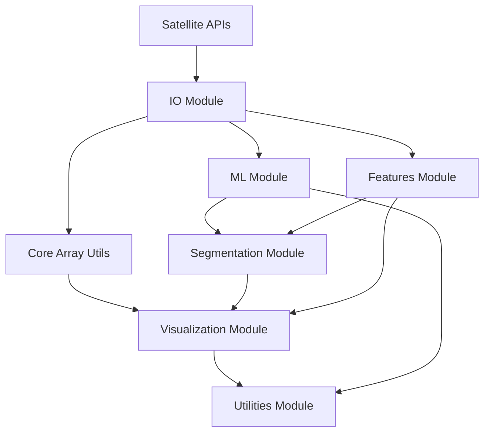

# Welcome to ShallowLearn

ShallowLearn is a Python toolkit for shallow water remote sensing analysis, particularly focused on coral reef environments. It integrates satellite data processing, machine learning workflows, and computer vision techniques for analyzing Sentinel-2 imagery and other remote sensing data.

## Key Features

- **Unified Satellite Data Access**: Download and process Landsat and Sentinel-2 data with consistent interfaces
- **Advanced IO Classes**: Smart satellite image loading with automatic band detection and metadata preservation
- **Machine Learning Pipeline**: QuickLook filtering, dimensionality reduction, and clustering for rapid analysis
- **Spectral Analysis**: Water quality indices and marine remote sensing calculations
- **Segmentation Tools**: Superpixel generation and processing for detailed analysis
- **Visualization**: Specialized plotting functions for remote sensing data

## Architecture Overview



## Module Overview

- **[IO Module](io_module.md)**: Loading and handling satellite imagery (Landsat, Sentinel-2, GeoTIFF)
- **[API Module](api_module.md)**: Unified satellite data download from USGS and Copernicus
- **[ML Module](ml_module.md)**: QuickLook filtering, PCA, t-SNE, clustering for rapid analysis
- **[Core Module](core_module.md)**: Fundamental array operations and utilities
- **[Features Module](features_module.md)**: Spectral indices, computer vision features, and depth-invariant indices
- **[Segmentation Module](segmentation_module.md)**: Superpixel generation and processing
- **[Visualization Module](visualization_module.md)**: Plotting, animations, and display functions
- **[Utilities Module](utilities_module.md)**: Helper functions and support tools

## Getting Started

1. **[Installation](installation.md)** - Set up ShallowLearn with uv
2. **[Quick Start](quickstart.md)** - Basic usage examples
3. **[API Reference](api_reference.md)** - Complete function documentation

## Package Management

**ShallowLearn exclusively supports [uv](https://docs.astral.sh/uv/) as the package manager.** This ensures consistent dependency management and faster installation.

```bash
# Install uv
curl -LsSf https://astral.sh/uv/install.sh | sh

# Install ShallowLearn
uv pip install -e .
```
