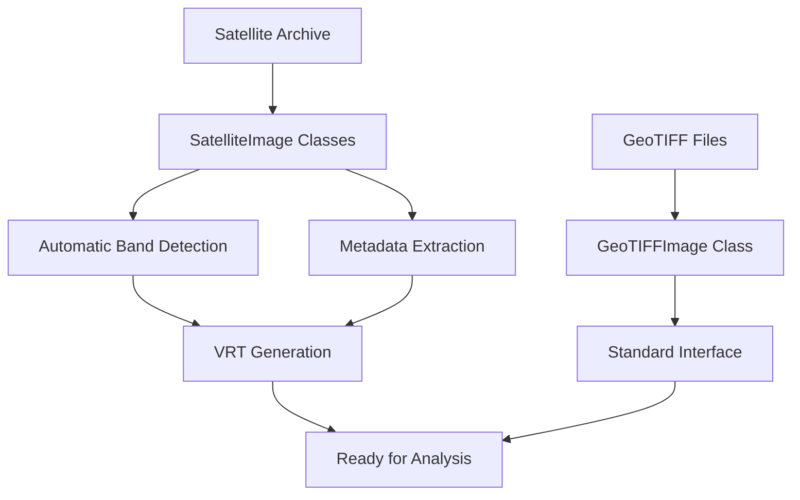

# IO Module Documentation

The IO module provides a comprehensive interface for loading, processing, and handling satellite imagery data. It supports both Landsat and Sentinel-2 imagery with automatic band detection, metadata preservation, and VRT generation.

## Overview



## Core Classes

### SatelliteImage (Abstract Base)

The base class for all satellite imagery with consistent interface across different satellites.

```python
from ShallowLearn.io import LandsatImage, Sentinel2Image

# Load a Landsat archive
landsat_img = LandsatImage("path/to/landsat.tar")
print(landsat_img)  # Shows band availability and metadata

# Load a Sentinel-2 archive  
sentinel_img = Sentinel2Image("path/to/sentinel2.zip")
print(sentinel_img)  # Shows band availability and metadata
```

### LandsatImage

Handles Landsat archives (tar files) with automatic band detection and metadata parsing.

```python
from ShallowLearn.io import LandsatImage

# Initialize Landsat image
landsat = LandsatImage("LT05_L1TP_157046_19920109_20200914_02_T1.tar")

# Check available bands
print(f"Available bands: {landsat.present_bands}")
print(f"Missing bands: {landsat.missing_bands}")

# Access image data
print(f"Image shape: {landsat.image.shape}")
print(f"Metadata: {landsat.meta}")

# Get specific band data
blue_band = landsat.get_band('B1')  # Landsat blue band
nir_band = landsat.get_band('B4')   # Landsat NIR band

# Calculate NDVI example
ndvi = (nir_band - landsat.get_band('B3')) / (nir_band + landsat.get_band('B3'))
```

**Landsat Band Mapping:**
- B1: Blue (0.45-0.52 μm)
- B2: Green (0.52-0.60 μm) 
- B3: Red (0.63-0.69 μm)
- B4: NIR (0.77-0.90 μm)
- B5: SWIR1 (1.55-1.75 μm)
- B6: Thermal (10.40-12.50 μm)
- B7: SWIR2 (2.08-2.35 μm)

### Sentinel2Image

Handles Sentinel-2 archives (zip files) with comprehensive band support.

```python
from ShallowLearn.io import Sentinel2Image

# Initialize Sentinel-2 image
sentinel = Sentinel2Image("S2A_MSIL1C_20230615T103021_20230615T103020_T32UQD_20230615T124531.zip")

# Check high-resolution bands (10m)
hr_bands = ['B02', 'B03', 'B04', 'B08']
for band in hr_bands:
    if band in sentinel.present_bands:
        print(f"Band {band} available at 10m resolution")

# Access RGB bands for visualization
rgb_image = sentinel.get_rgb_bands()  # Returns B04, B03, B02 (Red, Green, Blue)

# Calculate vegetation indices
red_edge = sentinel.get_band('B05')   # Red edge band
nir = sentinel.get_band('B08')        # NIR band
red = sentinel.get_band('B04')        # Red band

# NDVI calculation
ndvi = (nir - red) / (nir + red)

# Red Edge NDVI
if red_edge is not None:
    rndvi = (nir - red_edge) / (nir + red_edge)
```

**Sentinel-2 Band Mapping:**
- B01: Coastal/Aerosol (443 nm) - 60m
- B02: Blue (490 nm) - 10m
- B03: Green (560 nm) - 10m  
- B04: Red (665 nm) - 10m
- B05: Red Edge 1 (705 nm) - 20m
- B06: Red Edge 2 (740 nm) - 20m
- B07: Red Edge 3 (783 nm) - 20m
- B08: NIR (842 nm) - 10m
- B8A: NIR narrow (865 nm) - 20m
- B09: Water vapour (945 nm) - 60m
- B10: Cirrus (1375 nm) - 60m
- B11: SWIR1 (1610 nm) - 20m
- B12: SWIR2 (2190 nm) - 20m

### GeoTIFFImage

For working with pre-processed GeoTIFF files:

```python
from ShallowLearn.io import GeoTIFFImage

# Load a single GeoTIFF
geotiff = GeoTIFFImage("preprocessed_image.tif")

# Access data
print(f"Shape: {geotiff.image.shape}")
print(f"CRS: {geotiff.meta['crs']}")
print(f"Transform: {geotiff.meta['transform']}")

# Save processed data
geotiff.save("output_processed.tif")
```

## Collection Classes

### SatelliteImageCollection

Handle multiple satellite images with batch processing capabilities:

```python
from ShallowLearn.io import LandsatImageCollection, Sentinel2ImageCollection

# Load multiple Landsat images
landsat_collection = LandsatImageCollection([
    "landsat1.tar",
    "landsat2.tar", 
    "landsat3.tar"
])

# Batch process all images
for image in landsat_collection:
    print(f"Processing {image.path}")
    # Calculate indices
    ndvi = image.calculate_ndvi()
    # Apply your processing pipeline

# Filter collection by criteria
cloud_free = landsat_collection.filter_by_cloud_cover(max_cloud=10)
date_range = landsat_collection.filter_by_date("2020-01-01", "2020-12-31")
```

## Band Math Examples

The IO classes provide convenient methods for common band math operations:

### NDVI Calculation

```python
from ShallowLearn.io import Sentinel2Image
import numpy as np

# Load Sentinel-2 image
s2_img = Sentinel2Image("sentinel2_archive.zip")

# Method 1: Using built-in band access
red = s2_img.get_band('B04')
nir = s2_img.get_band('B08')

# Calculate NDVI with proper masking
ndvi = np.where(
    (red + nir) != 0,
    (nir - red) / (nir + red),
    np.nan
)

# Method 2: Using helper function (if available)
# ndvi = s2_img.calculate_ndvi()
```

### Water Index Calculation

```python
# Calculate NDWI (Normalized Difference Water Index)
green = s2_img.get_band('B03')
nir = s2_img.get_band('B08')

ndwi = np.where(
    (green + nir) != 0,
    (green - nir) / (green + nir),
    np.nan
)

# Calculate MNDWI (Modified NDWI) using SWIR
swir1 = s2_img.get_band('B11')
mndwi = np.where(
    (green + swir1) != 0,
    (green - swir1) / (green + swir1),
    np.nan
)
```

### Multi-band Index Calculations

```python
# Enhanced Vegetation Index (EVI)
blue = s2_img.get_band('B02')
red = s2_img.get_band('B04') 
nir = s2_img.get_band('B08')

# EVI formula: 2.5 * ((NIR - Red) / (NIR + 6*Red - 7.5*Blue + 1))
evi = 2.5 * ((nir - red) / (nir + 6*red - 7.5*blue + 1))

# Atmospheric Resistant Vegetation Index (ARVI)
arvi = (nir - (2*red - blue)) / (nir + (2*red - blue))
```

## VRT Builder Integration

The IO module integrates with VRT builders for efficient processing:

```python
from ShallowLearn.io import create_vrt_builder

# Create VRT from satellite archive
vrt_builder = create_vrt_builder("landsat_archive.tar", satellite_type="landsat")
vrt_path = vrt_builder.create_vrt()

# Load the VRT directly
from ShallowLearn.io import load_image
vrt_data = load_image(vrt_path)
```

## Error Handling and Validation

```python
from ShallowLearn.io import Sentinel2Image

try:
    s2_img = Sentinel2Image("corrupted_archive.zip")
except FileNotFoundError:
    print("Archive file not found")
except Exception as e:
    print(f"Error loading satellite image: {e}")

# Check band availability before processing
if 'B04' in s2_img.present_bands and 'B08' in s2_img.present_bands:
    ndvi = s2_img.calculate_ndvi()
else:
    print("Required bands for NDVI not available")
```

## Best Practices

1. **Always check band availability** before calculations
2. **Use proper masking** for invalid values (zeros, nodata)
3. **Handle different spatial resolutions** when mixing bands
4. **Preserve metadata** when saving processed results
5. **Use collections** for batch processing multiple images

## Integration with Other Modules

The IO module seamlessly integrates with other ShallowLearn modules:

```python
from ShallowLearn.io import Sentinel2Image
from ShallowLearn.spectral.indices import normalized_difference_chlorophyll_index
from ShallowLearn.visualization.display import plot_rgb

# Load image
s2_img = Sentinel2Image("sentinel2.zip")

# Calculate spectral index
ndci = normalized_difference_chlorophyll_index(s2_img.image)

# Visualize RGB
rgb_bands = [2, 1, 0]  # B04, B03, B02 indices
plot_rgb(s2_img.image, rgb_bands)
```