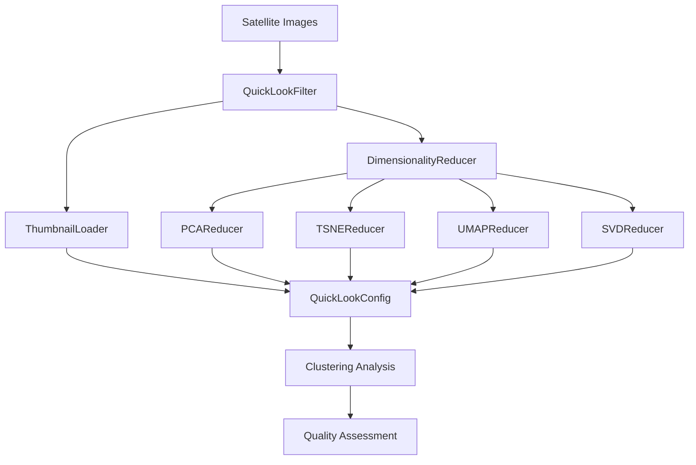

# Machine Learning Module Documentation

The ML module provides dimensionality reduction, clustering, and analysis components specifically designed for satellite imagery analysis. It includes the QuickLook filtering system for rapid image analysis and quality assessment.

## Overview



## Core Classes

### QuickLookConfig

Configuration class for QuickLook processing with comprehensive options:

```python
from ShallowLearn.ml import QuickLookConfig
from typing import Dict, Any

# Basic configuration
config = QuickLookConfig(
    reduction_method="pca",
    n_components=0.95,  # Retain 95% variance
    clustering_method="dbscan",
    target_size=(343, 343),  # Sentinel-2 native thumbnail size
    normalize=True
)

# Advanced configuration
advanced_config = QuickLookConfig(
    reduction_method="umap",
    n_components=10,
    clustering_method="kmeans",
    clustering_params={"n_clusters": 5, "random_state": 42},
    target_size=(256, 256),
    normalize=True,
    download_thumbnails=True,
    cache_dir="./quicklook_cache"
)

print(f"Using {config.reduction_method} with {config.n_components} components")
```

**Configuration Options:**
- `reduction_method`: "pca", "tsne", "umap", "svd"
- `n_components`: Number of components or variance ratio (0-1 for PCA)
- `clustering_method`: "dbscan", "kmeans", "gmm"
- `target_size`: Thumbnail dimensions tuple
- `normalize`: Whether to normalize data
- `download_thumbnails`: Enable thumbnail downloading
- `cache_dir`: Directory for caching thumbnails

### DimensionalityReducer (Abstract Base)

Base class for all dimensionality reduction methods:

```python
from ShallowLearn.ml import DimensionalityReducer
import numpy as np

# Example data preparation
satellite_data = np.random.rand(1000, 50)  # 1000 samples, 50 features

# All reducers follow the same interface:
# reducer = SomeReducer(n_components=10)
# reduced_data = reducer.fit_transform(satellite_data)
```

### PCAReducer

Principal Component Analysis for linear dimensionality reduction:

```python
from ShallowLearn.ml import PCAReducer
import numpy as np

# Prepare multispectral data
# Shape: (n_pixels, n_bands)
multispectral_data = np.random.rand(10000, 13)  # Simulated S2 data

# Variance-based reduction
pca_var = PCAReducer(n_components=0.95)  # Retain 95% variance
reduced_data = pca_var.fit_transform(multispectral_data)
print(f"Reduced from {multispectral_data.shape[1]} to {reduced_data.shape[1]} components")

# Fixed component reduction  
pca_fixed = PCAReducer(n_components=5)
reduced_fixed = pca_fixed.fit_transform(multispectral_data)

# Access PCA information
print(f"Explained variance ratio: {pca_var.explained_variance_ratio_}")
print(f"Cumulative variance: {np.cumsum(pca_var.explained_variance_ratio_)}")

# Get principal components for band importance analysis
components = pca_var.components_
print(f"First PC weights: {components[0]}")  # Band contributions to PC1
```

### TSNEReducer

t-SNE for non-linear dimensionality reduction and visualization:

```python
from ShallowLearn.ml import TSNEReducer
import matplotlib.pyplot as plt

# t-SNE for visualization (typically 2D)
tsne = TSNEReducer(
    n_components=2,
    perplexity=30,
    learning_rate=200,
    random_state=42
)

# Apply to subset of data (t-SNE is computationally expensive)
sample_indices = np.random.choice(multispectral_data.shape[0], 2000, replace=False)
sample_data = multispectral_data[sample_indices]

tsne_result = tsne.fit_transform(sample_data)

# Visualize t-SNE result
plt.figure(figsize=(10, 8))
plt.scatter(tsne_result[:, 0], tsne_result[:, 1], alpha=0.6)
plt.title("t-SNE Visualization of Multispectral Data")
plt.xlabel("t-SNE Component 1")
plt.ylabel("t-SNE Component 2")
plt.show()
```

### UMAPReducer

UMAP for fast non-linear dimensionality reduction:

```python
from ShallowLearn.ml import UMAPReducer

# Check if UMAP is available
try:
    umap_reducer = UMAPReducer(
        n_components=10,
        n_neighbors=15,
        min_dist=0.1,
        random_state=42
    )
    
    reduced_umap = umap_reducer.fit_transform(multispectral_data)
    print(f"UMAP reduction: {multispectral_data.shape} -> {reduced_umap.shape}")
    
except ImportError:
    print("UMAP not available. Install with: uv pip install umap-learn")

# UMAP for visualization
umap_viz = UMAPReducer(n_components=2)
umap_2d = umap_viz.fit_transform(sample_data)

plt.figure(figsize=(10, 8))
plt.scatter(umap_2d[:, 0], umap_2d[:, 1], alpha=0.6)
plt.title("UMAP Visualization of Multispectral Data")
plt.show()
```

### SVDReducer

Singular Value Decomposition for efficient linear reduction:

```python
from ShallowLearn.ml import SVDReducer

# SVD for large datasets
svd = SVDReducer(n_components=10)
reduced_svd = svd.fit_transform(multispectral_data)

print(f"SVD reduction: {multispectral_data.shape} -> {reduced_svd.shape}")
print(f"Singular values: {svd.singular_values_}")
```

### ThumbnailLoader

Handles downloading and processing of satellite image thumbnails:

```python
from ShallowLearn.ml import ThumbnailLoader
from ShallowLearn.api import SatelliteProduct

# Example satellite product
product = SatelliteProduct(
    product_id="S2A_MSIL1C_20230615T103021_20230615T103020_T32UQD_20230615T124531",
    satellite="sentinel2",
    sensor="MSI",
    acquisition_date="2023-06-15",
    cloud_cover=15.2,
    processing_level="L1C",
    thumbnail_url="https://example.com/thumbnail.jpg"
)

# Load and process thumbnail
loader = ThumbnailLoader(cache_dir="./thumbnails")
thumbnail_data = loader.load_thumbnail(product)

print(f"Thumbnail shape: {thumbnail_data.shape}")
print(f"Data type: {thumbnail_data.dtype}")
```

## Complete QuickLook Workflow

Here's a complete example combining all ML components:

```python
from ShallowLearn.ml import (
    QuickLookConfig, 
    QuickLookFilter,
    PCAReducer,
    TSNEReducer
)
from ShallowLearn.api import UnifiedSatelliteAPI
import numpy as np
import matplotlib.pyplot as plt

# Step 1: Configure QuickLook processing
config = QuickLookConfig(
    reduction_method="pca",
    n_components=0.95,
    clustering_method="dbscan",
    clustering_params={"eps": 50, "min_samples": 5},
    target_size=(343, 343),
    normalize=True,
    download_thumbnails=True
)

# Step 2: Search for satellite products
api = UnifiedSatelliteAPI()
products = api.search(
    bbox=[-74.0, 40.7, -73.9, 40.8],  # NYC area
    start_date="2023-06-01",
    end_date="2023-06-30",
    satellite="sentinel2",
    max_cloud_cover=20
)

# Step 3: Apply QuickLook filtering
filter_system = QuickLookFilter(config)
filtered_products = filter_system.filter_products(products)

print(f"Original products: {len(products)}")
print(f"Filtered products: {len(filtered_products)}")

# Step 4: Analyze the filtering results
for product in filtered_products[:5]:  # Show first 5
    print(f"Product: {product.product_id}")
    print(f"  Cloud cover: {product.cloud_cover}%")
    print(f"  Quality score: {product.metadata.get('quality_score', 'N/A')}")
```

## Advanced Analysis Examples

### Multi-temporal Analysis

```python
from ShallowLearn.ml import PCAReducer
import numpy as np

# Simulate time series of multispectral data
# Shape: (n_timestamps, height, width, n_bands)
time_series_data = np.random.rand(10, 100, 100, 13)

# Flatten spatial dimensions for PCA
n_times, h, w, n_bands = time_series_data.shape
flattened_data = time_series_data.reshape(-1, n_bands)

# Apply PCA
pca = PCAReducer(n_components=5)
pca_result = pca.fit_transform(flattened_data)

# Reshape back to spatial format
pca_spatial = pca_result.reshape(n_times, h, w, 5)

# Analyze temporal patterns in PC space
temporal_means = np.mean(pca_spatial, axis=(1, 2))  # Mean PC values per timestamp

plt.figure(figsize=(12, 8))
for i in range(5):
    plt.subplot(2, 3, i+1)
    plt.plot(temporal_means[:, i])
    plt.title(f"Principal Component {i+1}")
    plt.xlabel("Time")
    plt.ylabel("PC Value")
plt.tight_layout()
plt.show()
```

### Clustering Analysis

```python
from sklearn.cluster import DBSCAN, KMeans
from sklearn.mixture import GaussianMixture

# Apply dimensionality reduction first
pca = PCAReducer(n_components=10)
reduced_data = pca.fit_transform(multispectral_data)

# DBSCAN clustering
dbscan = DBSCAN(eps=0.5, min_samples=10)
dbscan_labels = dbscan.fit_predict(reduced_data)
n_clusters_dbscan = len(set(dbscan_labels)) - (1 if -1 in dbscan_labels else 0)
print(f"DBSCAN found {n_clusters_dbscan} clusters")

# K-means clustering
kmeans = KMeans(n_clusters=5, random_state=42)
kmeans_labels = kmeans.fit_predict(reduced_data)

# Gaussian Mixture Model
gmm = GaussianMixture(n_components=5, random_state=42)
gmm_labels = gmm.fit_predict(reduced_data)

# Compare clustering results
plt.figure(figsize=(15, 5))
plt.subplot(1, 3, 1)
plt.scatter(reduced_data[:, 0], reduced_data[:, 1], c=dbscan_labels, alpha=0.6)
plt.title("DBSCAN Clustering")

plt.subplot(1, 3, 2)
plt.scatter(reduced_data[:, 0], reduced_data[:, 1], c=kmeans_labels, alpha=0.6)
plt.title("K-means Clustering")

plt.subplot(1, 3, 3)
plt.scatter(reduced_data[:, 0], reduced_data[:, 1], c=gmm_labels, alpha=0.6)
plt.title("GMM Clustering")
plt.show()
```

### Feature Importance Analysis

```python
# Analyze which spectral bands contribute most to principal components
pca = PCAReducer(n_components=5)
pca.fit(multispectral_data)

# Band names for Sentinel-2
band_names = ['B01', 'B02', 'B03', 'B04', 'B05', 'B06', 'B07', 
              'B08', 'B8A', 'B09', 'B10', 'B11', 'B12']

# Plot component loadings
plt.figure(figsize=(15, 10))
for i in range(5):
    plt.subplot(2, 3, i+1)
    loadings = pca.components_[i]
    plt.bar(band_names, loadings)
    plt.title(f"PC{i+1} Loadings (Variance: {pca.explained_variance_ratio_[i]:.3f})")
    plt.xticks(rotation=45)
    plt.ylabel("Loading")

plt.tight_layout()
plt.show()

# Find most important bands for each PC
for i in range(5):
    loadings = np.abs(pca.components_[i])
    top_bands = np.argsort(loadings)[-3:][::-1]  # Top 3 bands
    print(f"PC{i+1} most important bands: {[band_names[j] for j in top_bands]}")
```

## Integration with Other Modules

```python
from ShallowLearn.io import Sentinel2Image
from ShallowLearn.ml import PCAReducer
from ShallowLearn.spectral.indices import normalized_difference_chlorophyll_index
from ShallowLearn.visualization.display import plot_rgb

# Load satellite image
s2_img = Sentinel2Image("sentinel2_archive.zip")

# Apply ML processing
pixels = s2_img.image.reshape(-1, s2_img.image.shape[-1])
pca = PCAReducer(n_components=5)
pca_result = pca.fit_transform(pixels)

# Reshape back to image format
h, w = s2_img.image.shape[:2]
pca_image = pca_result.reshape(h, w, 5)

# Visualize first three principal components as RGB
plot_rgb(pca_image, [0, 1, 2])

# Calculate spectral indices on original data
ndci = normalized_difference_chlorophyll_index(s2_img.image)
```

## Best Practices

1. **Choose appropriate reduction method:**
   - PCA: Linear relationships, interpretable components
   - t-SNE: Visualization, small datasets
   - UMAP: Fast non-linear reduction, large datasets
   - SVD: Large datasets, memory efficient

2. **Data preprocessing:**
   - Always normalize data before dimensionality reduction
   - Handle missing values appropriately
   - Consider outlier removal

3. **Parameter selection:**
   - Use cross-validation for parameter tuning
   - Start with default parameters and adjust based on results
   - Consider computational constraints

4. **Memory management:**
   - Use batch processing for large datasets
   - Consider data subsampling for t-SNE
   - Cache intermediate results when possible